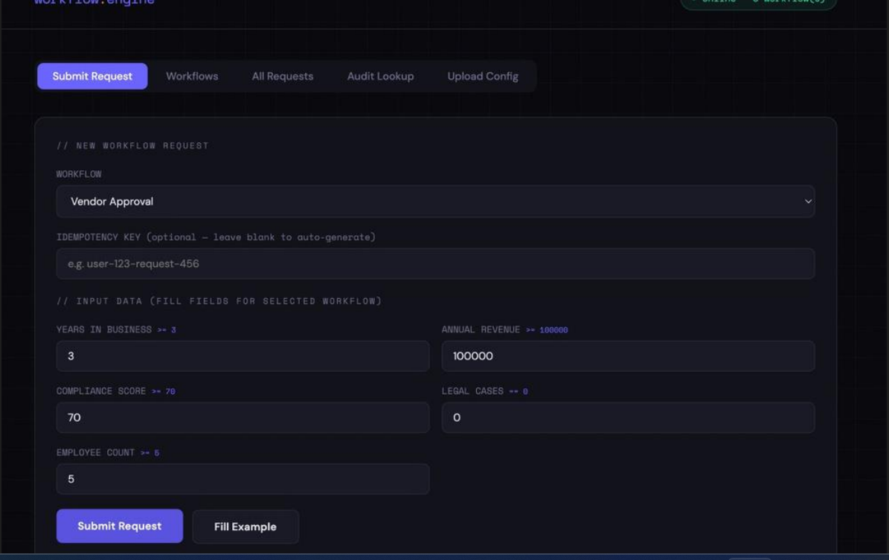
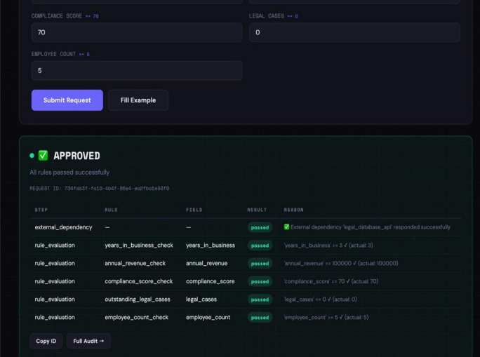
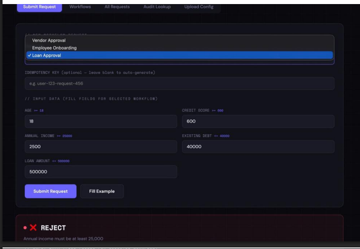
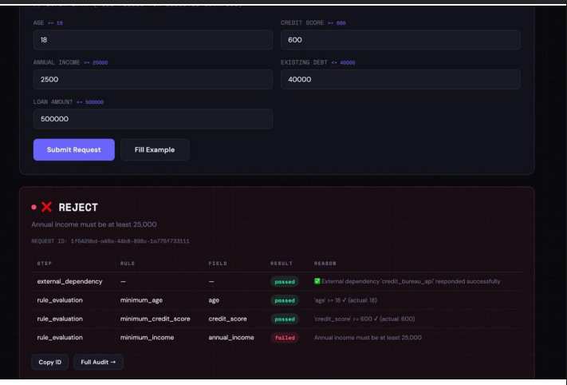

# Workflow Decision Engine

**Author:** Preet Jaiswal

A configurable platform that processes business requests, evaluates rules, and makes decisions — with full audit trails and failure handling baked in.

Built for the hackathon assignment. Uses Python, FastAPI, SQLite, and Gemini AI for config conversion.

---

## What it does

You send it a request (like a loan application or employee onboarding form). It runs it through a set of rules defined in a config file, then decides: approve, reject, send for manual review, or retry if something failed. Every decision is logged with a full explanation of which rule triggered it and why.

The core design decision here was to keep business logic out of code entirely. Rules and workflows live in YAML config files — so changing a threshold or adding a new step never requires a code change or redeployment. This was intentional, because real business rules change frequently and the system needs to absorb that without breaking.

---

## Why it's built this way

**Config-driven rules** — the engine reads YAML files at startup. To add a new workflow, you drop a new file in the `workflows/` folder. To change a rule threshold, you edit a number in the YAML. No code touched, no tests broken.

**Fail-fast rule evaluation** — rules are evaluated in order and stop at the first failure. This keeps audit trails clean and decisions easy to explain. The evaluator knows exactly which rule failed and why.

**Idempotency by design** — every request carries an idempotency key. Submitting the same request twice returns the same result without reprocessing. This matters in real systems where network retries are common.

**Simulated external dependency** — before rules run, the engine calls a simulated external service (like a credit bureau). It has a 20% random failure rate to demonstrate retry logic. When it fails, the request moves to `retry` status and can be retried via API or UI.

**Gemini for config conversion** — if an uploaded config uses a different structure, the system detects it and sends it to Gemini to normalize it. This means the engine accepts config files from any source without manual reformatting.

---

- **FastAPI** — API server
- **SQLite + SQLAlchemy** — stores requests, audit logs, state history
- **PyYAML** — reads workflow config files
- **Gemini AI** — converts foreign config formats into our schema automatically
- **Pytest** — 17 test cases covering all major flows
- **Vanilla HTML/CSS/JS** — minimal UI, no framework needed

---

## Setup

**1. Clone or download the project**

**2. Create and activate a virtual environment**

```bash
python -m venv venv
source venv/bin/activate        # Mac/Linux
venv\Scripts\activate           # Windows
```

**3. Install dependencies**

```bash
pip install -r requirements.txt
```

**4. Add your Gemini API key**

Open the `.env` file and paste your key:

```
GEMINI_API_KEY=your_key_here
```

Get a free key at https://aistudio.google.com/app/apikey

**5. Run the server**

```bash
uvicorn main:app --reload
```

You should see this in the terminal:

```
✅ Database initialized successfully
📄 Loaded workflow: loan_approval
📄 Loaded workflow: employee_onboarding
🚀 Loaded 2 workflow(s)
```

**6. Open the UI**

Go to http://localhost:8000

## UI Interface









---

## Running tests

Open a second terminal, activate the venv, then:

```bash
pytest test_engine.py -v
```

All 17 tests should pass. The test suite covers happy paths, rejections, missing fields, duplicate requests, retries, audit logging, config validation, and rule change scenarios.

---

## Project structure

```
├── main.py                  # API routes (FastAPI)
├── engine.py                # Core decision logic
├── models.py                # Database schema
├── config_loader.py         # Reads YAML configs + Gemini conversion
├── test_engine.py           # Test suite
├── .env                     # API keys (not committed to git)
├── requirements.txt
├── workflows/
│   ├── loan_approval.yaml
│   └── employee_onboarding.yaml
└── static/
    └── index.html           # Web UI
```

---

## How the workflow config works

Each workflow is just a YAML file in the `workflows/` folder. No code changes needed to add or modify workflows — just edit the file and restart the server.

```yaml
workflow_name: loan_approval
description: "Evaluates loan applications"

steps:
  - validate_input
  - check_external_credit_bureau
  - evaluate_rules
  - final_decision

rules:
  - name: minimum_credit_score
    field: credit_score
    operator: ">="
    value: 600
    on_fail: reject
    message: "Credit score must be at least 600"

external_dependency:
  name: credit_bureau_api
  simulate: true
  failure_action: retry
```

Supported operators: `>= <= > < == != in not_in`

On fail actions: `reject`, `manual_review`, `retry`

---

## Gemini config conversion

If you upload a config file that uses a different structure (different key names, different format), the system detects it fails validation and sends it to Gemini to convert it automatically. This means the engine can accept config files from other teams or tools without any manual reformatting.

To test this, upload `vendor_approval_foreign.yaml` from the Upload Config tab. It uses completely different key names (`process_name`, `validations`, `pipeline`) and Gemini converts it to the correct format on the fly.

---

## API endpoints

| Method | Endpoint | What it does |
|--------|----------|--------------|
| GET | `/` | Web UI |
| GET | `/health` | Server status and loaded workflows |
| GET | `/workflows` | List all workflows and their rules |
| POST | `/submit` | Submit a new request |
| POST | `/retry/{id}` | Retry a failed request (max 3 retries) |
| GET | `/status/{id}` | Current status of a request |
| GET | `/audit/{id}` | Full audit trail with rule evaluations and state history |
| GET | `/requests` | List recent requests |
| POST | `/upload-config` | Upload a new workflow config |

---

## Submitting a request via curl

```bash
curl -X POST http://localhost:8000/submit \
  -H "Content-Type: application/json" \
  -d '{
    "workflow_name": "loan_approval",
    "idempotency_key": "user-001-attempt-1",
    "input_data": {
      "age": 30,
      "credit_score": 720,
      "annual_income": 60000,
      "existing_debt": 10000,
      "loan_amount": 100000
    }
  }'
```

---

## Idempotency

Every request takes an optional `idempotency_key`. If you submit the same key twice, the system returns the original result without reprocessing. This handles cases like network retries or accidental double submissions. Leave it blank and the system auto-generates one.

---

## External dependency simulation

The engine simulates an external API call (like a credit bureau or HR system) before running rules. It has a 20% random failure rate built in. When it fails, the request goes into `retry` status and you can retry it manually from the UI or via the API. This demonstrates real-world failure handling without needing an actual external service.

---

## Scaling notes

- SQLite works fine for demos and low traffic. For production, swap to PostgreSQL by changing one line in `models.py`
- The workflow engine is stateless — you can run multiple instances behind a load balancer
- Config files are loaded once on startup. To hot-reload configs without restarting, use the `/upload-config` endpoint
- Audit logs grow over time — in production, add a retention policy or archive old records

---

## What's not included

- Authentication — adding API key or JWT auth would be the next step
- Async rule evaluation — rules run sequentially right now; parallel evaluation would speed things up for complex workflows
- Webhook notifications — could notify downstream systems when a decision is made
